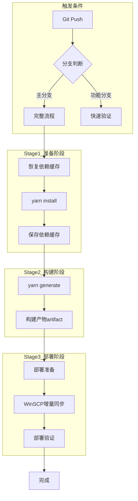
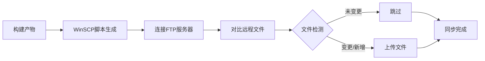
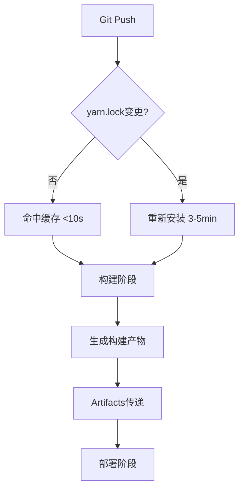

# GitLab CI/CD 增量部署架构设计方案

## 📋 文档信息

- **项目名称**: Nuxt.js 静态站点增量部署优化
- **设计日期**: 2024-12-21
- **设计版本**: v1.0
- **设计原则**: KISS（Keep It Simple, Stupid）+ 渐进式优化

---

## 1. 执行摘要

### 1.1 当前问题分析

基于现有 `.gitlab-ci.yml` 配置分析，存在以下核心痛点：

| 痛点类别 | 具体问题 | 影响 |
|---------|---------|------|
| **依赖安装** | 每次 `yarn install` 完整安装，无缓存复用 | 构建时间 3-5 分钟 |
| **构建策略** | 全量构建所有页面，无增量机制 | 构建时间随页面数线性增长 |
| **部署方式** | 递归上传所有文件，无变更检测 | 部署时间 5-10 分钟 |
| **FTP 性能** | 使用 .NET FtpWebRequest，单文件串行上传 | 上传效率低，无并行 |
| **容错能力** | 单文件失败导致整体失败 | 稳定性差 |

**总耗时估算**: 构建 3-5 分钟 + 部署 5-10 分钟 = **8-15 分钟/次**

### 1.2 优化目标

| 优化维度 | 目标 | 预期收益 |
|---------|------|---------|
| **依赖安装** | 缓存 node_modules，命中率 >90% | 节省 2-4 分钟 |
| **构建时间** | 优化构建流程 | 保持或略微提升 |
| **部署时间** | 仅上传变更文件 + 并行上传 | 节省 60-90% 部署时间 |
| **总耗时** | 首次 8-15 分钟，后续 2-5 分钟 | **减少 60-75% 时间** |

---

## 2. 整体架构设计

### 2.1 CI/CD Pipeline 架构图



### 2.2 优化后的 Pipeline 结构

#### **Stage 划分**

```yaml
stages:
  - setup      # 依赖安装和缓存
  - build      # 构建静态站点
  - deploy     # 增量部署
```

#### **Job 职责定义**

| Stage | Job 名称 | 职责 | 输入 | 输出 | 缓存策略 |
|-------|---------|------|------|------|---------|
| setup | `install-deps` | 安装 Node.js 依赖 | yarn.lock | node_modules/ | 读写缓存 |
| build | `build-site` | 构建 Nuxt.js 静态站点 | 源码 + node_modules | .output/public/ | 读缓存 |
| deploy | `deploy-incremental` | WinSCP 增量同步到 FTP | .output/public/ | 部署结果 | 无 |

---

## 3. 增量检测方案设计

### 3.1 方案对比分析

| 方案 | 技术实现 | 优势 | 劣势 | Windows兼容性 | 推荐度 |
|------|---------|------|------|---------------|--------|
| **方案A: Git Diff** | `git diff --name-only` | ✅ 简单<br>✅ 无依赖 | ❌ 检测不准确<br>❌ 重命名误判 | ✅ 原生 | ⭐⭐⭐ |
| **方案B: 文件哈希** | MD5/SHA256 对比 | ✅ 精确<br>✅ 内容感知 | ❌ 实现复杂<br>❌ 需维护哈希库 | ✅ 原生 | ⭐⭐⭐⭐ |
| **方案C: LFTP** | `lftp mirror` | ✅ 成熟工具<br>✅ 性能好 | ❌ 需要 Docker<br>❌ Windows不友好 | ❌ 需Docker | ⭐⭐ |
| **方案D: WinSCP** | WinSCP 同步 | ✅ Windows原生<br>✅ 稳定可靠<br>✅ 自动增量 | ⚠️ 需预装工具 | ✅ 完美 | ⭐⭐⭐⭐⭐ |

### 3.2 推荐方案：WinSCP 增量同步

#### **选型理由**

1. **Windows 原生支持** - 无需 Docker，直接在 Windows Runner 运行
2. **开箱即用** - WinSCP 提供成熟的 FTP 同步功能
3. **自动增量检测** - 基于文件大小和时间戳自动判断
4. **断点续传** - 网络中断后可恢复上传
5. **性能优秀** - 支持并行上传，传输速度快

#### **实现架构**



#### **技术实现**

**步骤1: Runner 环境准备**
```powershell
# 在 GitLab Runner 机器上预装 WinSCP
# 方式1: Chocolatey 安装
choco install winscp -y

# 方式2: 手动下载安装
# 下载: https://winscp.net/download/WinSCP-5.21.8-Setup.exe
```

**步骤2: 生成 WinSCP 同步脚本**
```powershell
# 在 deploy-job 中动态生成脚本
$winscp_script = @"
option batch abort
option confirm off
option reconnecttime 30
open ftp://${env:FTP_USER}:${env:FTP_PASS}@${env:FTP_HOST}
option transfer binary
synchronize remote -criteria=size,time -resumesupport=on -delete .output/public /aib
close
exit
"@

# 保存脚本文件
$winscp_script | Out-File -Encoding ASCII winscp-sync.txt
```

**步骤3: 执行增量同步**
```powershell
# 执行 WinSCP 命令行工具
$winscp_path = "C:\Program Files (x86)\WinSCP\WinSCP.com"
& $winscp_path /script=winscp-sync.txt /log=winscp.log /loglevel=1

# 检查执行结果
if ($LASTEXITCODE -ne 0) {
    Write-Error "WinSCP synchronization failed with code $LASTEXITCODE"
    Write-Host "=== WinSCP Log ==="
    Get-Content winscp.log | Select-Object -Last 50
    exit 1
}

Write-Host "Deployment completed successfully"
```

#### **关键参数说明**

| 参数 | 作用 | 说明 |
|------|------|------|
| `-criteria=size,time` | 对比策略 | 基于文件大小和修改时间判断变更 |
| `-resumesupport=on` | 断点续传 | 支持网络中断后恢复上传 |
| `-delete` | 删除远程孤立文件 | 删除本地已不存在的远程文件（可选） |
| `/loglevel=1` | 日志级别 | 0=详细, 1=正常, 2=简洁 |

### 3.3 备选方案：文件哈希检测

适用于需要极致精确控制的场景：

```powershell
# 生成文件哈希清单
function Get-FileHashManifest {
    param([string]$Path)
    
    $manifest = @{}
    Get-ChildItem -Path $Path -Recurse -File | ForEach-Object {
        $relativePath = $_.FullName.Replace($Path, "").TrimStart('\', '/')
        $hash = (Get-FileHash $_.FullName -Algorithm MD5).Hash
        $manifest[$relativePath] = @{
            hash = $hash
            size = $_.Length
            modified = $_.LastWriteTimeUtc
        }
    }
    return $manifest
}

# 对比清单找出变更文件
$currentManifest = Get-FileHashManifest ".output/public"
$previousManifest = Get-Content "previous-manifest.json" | ConvertFrom-Json -AsHashtable

$changedFiles = @()
foreach ($file in $currentManifest.Keys) {
    if (-not $previousManifest.ContainsKey($file) -or 
        $previousManifest[$file].hash -ne $currentManifest[$file].hash) {
        $changedFiles += $file
    }
}

Write-Host "Changed files: $($changedFiles.Count)"
```

---

## 4. 缓存架构设计

### 4.1 缓存层次结构



### 4.2 缓存键设计

#### **Layer 1: node_modules 缓存**

```yaml
cache:
  key:
    files:
      - yarn.lock  # 基于 yarn.lock 文件内容生成 SHA 哈希
  paths:
    - node_modules/
    - .yarn-cache/
  policy: pull-push  # setup stage 需要读写
```

**缓存策略说明**:

| 配置项 | 值 | 作用 |
|-------|----|----|
| `key.files` | `yarn.lock` | 依赖变更时自动失效缓存 |
| `paths` | `node_modules/`, `.yarn-cache/` | 缓存依赖目录和 Yarn 缓存 |
| `policy` | `pull-push` | setup 阶段读写，build 阶段只读 |

**缓存命中率优化**:
- ✅ 仅依赖变更时重建 → 命中率 >90%
- ✅ 跨分支共享缓存（基于文件内容）
- ✅ 自动过期和垃圾回收

#### **缓存失效触发条件**

```yaml
# 以下情况会导致缓存失效：
1. yarn.lock 文件内容变更
2. 手动清除 GitLab CI/CD 缓存
3. cache:policy 从 pull-push 改为 push
```

### 4.3 Artifacts 传递

